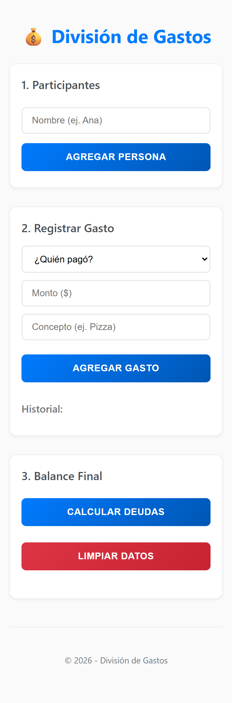
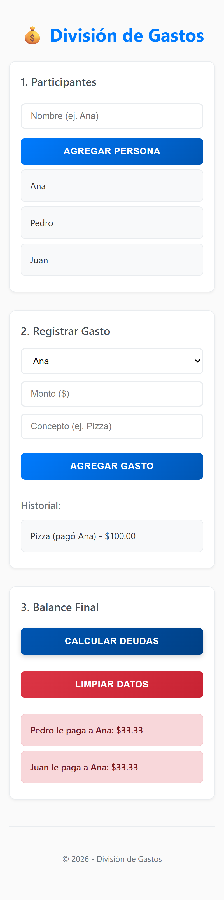

# División de Gastos

App web para dividir gastos compartidos de forma justa entre varias personas y generar las transacciones mínimas necesarias para saldar deudas.

## Idioma

- Versión en español (este archivo).
- Versión en inglés: [README.md](./README.md).
- La interfaz de la app está disponible en español.

## Características

- Agregar y gestionar participantes
- Registrar gastos (quién pagó y cuánto)
- Calcular balances automáticamente
- Generar transacciones mínimas para saldar deudas

## Tecnologías

- [React](https://react.dev/)
- [Vite](https://vite.dev/)
- TypeScript
- ESLint + Prettier

## Requisitos

- Node.js 18+ (recomendado)
- npm 9+

## Inicio rápido

```bash
git clone <url-del-repositorio>
cd split-app
npm install
npm run dev
```

Luego abre la URL local que se muestra en la terminal (normalmente `http://localhost:5173`).

## Scripts disponibles

```bash
npm run dev          # Inicia el servidor de desarrollo
npm run build        # Genera el build de producción
npm run preview      # Previsualiza el build localmente
npm run lint         # Ejecuta ESLint
npm run lint:fix     # Ejecuta ESLint y aplica auto-fixes
npm run format       # Formatea con Prettier
npm run format:check # Verifica el formato
```

## Cómo usar

1. Agrega participantes.
2. Registra cada gasto con:
   - quién pagó
   - monto
   - descripción/fecha (si aplica)
3. Revisa los balances calculados.
4. Usa las transacciones mínimas sugeridas para saldar las deudas.

## Capturas de pantalla




## Licencia

Este proyecto se distribuye bajo la [Licencia MIT](./LICENSE).
